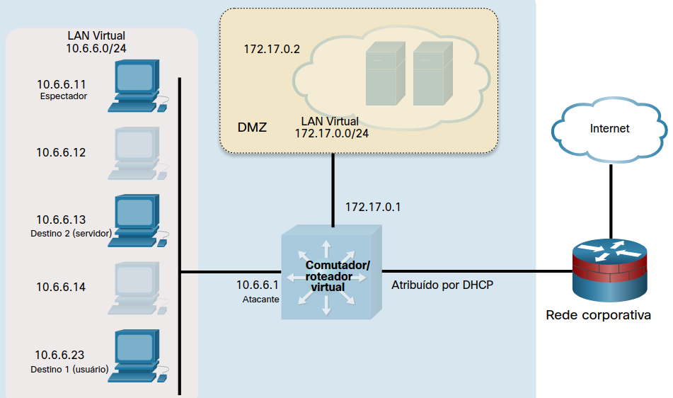

# Laboratório - Ataques no Caminho com Ettercap
Topologia

LAN Virtual
10.6.6.0/24
10.6.6.11
Espectador
10.6.6.12
10.6.6.13
Destino 2 (servidor)
10.6.6.14
10.6.6.23
Destino 1 (usuário)
172.17.0.2
DMZ
LAN Virtual
172.17.0.0/24
172.17.0.1
10.6.6.1
Atacante
Comutador/roteador virtual
Atribuído por DHCP
Rede corporativa
Internet
Objetivos

Neste laboratório, você cumprirá os seguintes objetivos:

    Parte 1: Iniciar o Ettercap e explorar suas capacidades
    Parte 2: Executar o Ataque no Caminho (MITM)
    Parte 3: Usar Wireshark para observar o Ataque de Falsificação ARP

Fundo / Cenário

Ataques no caminho são formas muito poderosas de roubar dados que estão trafegando em uma rede. Sem criptografia de ponta a ponta, como ocorre com muitos dados que trafegam em LANs locais, é fácil capturar informações em texto claro e até mesmo arquivos completos, usando métodos de ataque em caminho.

Observação: Em caminho está substituindo o MITM (man-in-the-middle) como o nome deste tipo de ataque. O processo de substituição está incompleto; no entanto, você pode ainda ver o MITM em muitos lugares, incluindo algumas perguntas do exame. Saiba que os dois termos são intercambiáveis no momento.
Recursos Necessários

    VM Kali personalizada para o curso de Hacker Ético

Instruções Parte 1: Inicie o Ettercap e explore suas capacidades.

O Ettercap é usado para realizar ataques no caminho (MITM). O objetivo de um ataque no caminho é interceptar o tráfego entre dispositivos para obter informações que possam ser usadas para representar o alvo ou alterar dados transmitidos. O agressor está situado entre dois hosts de comunicação. Em ataques no caminho, o hacker não precisa comprometer o dispositivo de destino, mas pode apenas farejar o tráfego passando para frente e para trás entre o alvo e o destino. O Ettercap é usado como uma ferramenta no caminho e a máquina de ataque está na mesma rede IP da vítima.
Etapa 1: Configurar um ataque de falsificação de ARP.

Neste ataque, você usará falsificação de ARP para redirecionar o tráfego na rede virtual local para o sistema Kali Linux em 10.6.6.1. A falsificação de ARP é frequentemente usada para representar o roteador de gateway padrão para capturar todo o tráfego entrando ou saindo da rede IP local. Como o ambiente do seu laboratório usa uma rede virtual interna, em vez de falsificar o gateway padrão, você usará falsificação de ARP para redirecionar o tráfego destinado a um servidor local com o endereço 10.6.6.13.

    Carregue Kali Linux usando o nome de usuário kali e a senha kali. Abra uma sessão de terminal na barra de menus na parte superior da tela.
    O host de destino deste laboratório é o dispositivo Linux em 10.6.6.23. Para visualizar a rede da perspectiva de destino e iniciar o tráfego entre o destino e o servidor, use SSH para fazer login nesse host. O nome de usuário é labuser e a senha é Cisco123.

O usuário do host 10.6.6.23 está se comunicando com o servidor em 10.6.6.13. O atacante no caminho da 10.6.6.1 (sua VM kali) interceptará e retransmitirá o tráfego entre esses hosts.

Observação: a senha não será exibida na tela.

┌──(kali㉿Kali)-[~]

└─# ssh -l labuser 10.6.6.23

Se você receber a seguinte mensagem, responda yes para continuar.

A autenticidade do host '10.6.6.23 (10.6.6.23)' não pode ser estabelecida.

ED25519 impressão digital da chave é SHA256:u3Yjj1imvIGFFU6uLfJlAyM+BC1AXhLyO45oPedjNk8.

Essa chave não é conhecida por nenhum outro nome.

Tem certeza de que deseja continuar a conexão (yes/não/[impressão digital])? 

Aviso: Adicionado permanentemente '10.6.6.23' (ED25519) à lista de hosts conhecidos.

 

Senha do labuser@10.6.6.23: Cisco123

    Uma vez que você estiver criando um ataque no caminho que usa falsificação de ARP, você estará monitorando os mapeamentos de ARP no host da vítima. O ataque causará alterações nesses mapeamentos.

Use o comando ip neighbor para visualizar o cache ARP atual no computador de destino. OBSERVAÇÃO: o nome do host 3fb0515ea2f7 talvez seja diferente para o ambiente da VM Kali.

labuser@3fb0515ea2f7:/$ ip neighbor

10.6.6.1 dev eth0 lladdr 02:42:17:81:d2:45 ALCANÇÁVEL (a saída pode variar)

OBSERVAÇÃO: se estiver usando a versão ARM CPUs (Apple M1/M2) da VM, você precisará mudar para usar o root com a senha Cisco123 e usar o comando arp -a no lugar de ip neighbor para ver o cache ARP atual durante toda essa atividade.

labuser@gravemind:/$ su -

Senha: Cisco123

root@gravemind:/$ arp -a

? (10.6.6.1) às 02:42:17:d5:bb:2b:ab [ether] em eth0

Quantas entradas existem no cache ARP atual?
Answer Area
As respostas podem variar. No mínimo, haverá um para a instância 10.6.6.1 Kali. É a máquina do agressor.
Qual é o endereço MAC da máquina do atacante Kali?
Answer Area
As respostas podem variar devido ao ambiente virtual. Neste exemplo, é 02:42:17:81:d2:45.
Etapa 2: Carregar interface GUI de Ettercap para começar a fazer varredura.

    Abra uma nova sessão terminal a partir da barra de menus em Kali Linux. Não feche o terminal SSH que está executando a sessão com 10.6.6.23.
    Use o comando ettercap -h para exibir o arquivo de ajuda do aplicativo Ettercap.

┌──(kali㉿kali)-[~]

└─# ettercap -h

    Examine o conteúdo do arquivo de ajuda.

Quantas interfaces de usuário estão disponíveis para a ferramenta Ettercap? Quais são as opções usadas para especificar as interfaces de usuário?
Answer Area
Quatro interfaces de usuário estão disponíveis e as opções são -T, -C, -D, -G.

    Nessa parte, você utilizará uma interface gráfica para acessar a Ettercap. Inicie a interface gráfica do usuário Ettercap GTK+ usando o comando ettercap -G . A maioria das funções de Ettercap exige permissões raiz, portanto, use o comando sudo para obter as permissões necessárias.

┌──(kali㉿kali)-[~]

└─# sudo ettercap -G

    A GUI da Ettercap é aberta em uma nova janela. Você está monitorando o tráfego em uma rede interna, virtual. A configuração padrão é para escanear usando interface eth0. Altere a interface de sniffing para br-internal, que é a interface configurada na rede virtual 10.6.6.0/24, alterando o valor no menu suspenso Configuração da Interface Primária > . Clique no ícone do checkbox
    no canto superior direito da tela da Ettercap para continuar. Uma mensagem aparece na parte inferior da tela indicando que o sniffing unificado começou.

Parte 2: Execute o ataque On-Path (MITM)
Etapa 1: Selecione os dispositivos de destino. Na janela GUI da Ettercap, abra a janela Lista de Hosts clicando no menu Ettercap (ícone de três pontos).

    Selecione a entrada Hosts e, em seguida, a Lista de Hosts. Clique no ícone Escanear para Hosts (lupa) na parte superior esquerda da barra de menus. Uma lista dos hosts descobertos na rede 10.6.6.0/24 aparece na janela Lista de hosts.

Quantos hosts foram descobertos?
Answer Area
5

Pelo menos um dos endereços MAC devem ser familiares.

    Defina os dispositivos de origem e destino para o ataque. Para fazer isso, clique no endereço IP 10.6.6.23 na janela para destacar o host do usuário de destino. Clique no botão Adicionar ao Destino 1 na parte inferior da janela Lista de hosts. Isso define o host do usuário como Alvo 1.
    Clique no endereço IP do servidor Web de destino em 10.6.6.13 para realçar a linha. Clique no botão Adicionar ao Destino 2 na parte inferior da janela do host.

Qualquer endereço IP/MAC especificado como Alvo 1 terá todo o seu tráfego desviado pelo computador de ataque que está executando Ettercap. Neste laboratório, o computador de ataque é a máquina Kali Linux em 10.6.6.1. Todos os outros computadores na sub-rede, além dos alvos, se comunicarão normalmente.

    Clique no ícone MITM na barra de menus (o primeiro ícone circular na parte superior direita). Selecione envenenamento ARP... no menu suspenso. Verifique sefarejar conexões remotas está selecionado. Clique em OK.
    O exploit MITM foi iniciado. Se o sniffing não iniciar imediatamente, clique na opção Iniciar (botão reproduzir) à esquerda no menu superior.

Passo 2: Execute o ataque de falsificação de ARP.

    Retorne à janela do terminal que está executando a sessão SSH com o host do usuário alvo em 10.6.6.23. Repita o ping para 10.6.6.13

labuser@3fb0515ea2f7:/$ ping -c 5 10.6.6.13

    Use o comando ip neighbor para ver a tabela ARP em 10.6.6.23 novamente. Observe o endereço MAC listado para 10.6.6.13.

O endereço MAC associado ao 10.6.6.13 é o mesmo que você gravou na Parte 1, Etapa 1e?

Não. Agora é o mesmo que o MAC do 10.6.6.1, a VM Kali que está executando o Ettercap.

O que há de estranho nisso?

Os endereços MAC devem ser exclusivos globalmente, por isso é estranho que dois dispositivos tenham o mesmo endereço MAC.

Qual é o efeito dessa mudança?

Os pacotes que são enviados na LAN para 10.6.6.13 serão recebidos tanto pelo host desejado quanto pelo atacante VM Kali.

    Feche a interface gráfica do usuário do Ettercap. Deixe a conexão SSH com 10.6.6.23 ativa.

Parte 3: Use Wireshark para observar o ataque de spoofing de ARP

Etapa 1: Selecione os dispositivos de destino e execute o ataque MITM usando a interface de linha de comando

Nesta etapa, você usará a interface de linha de comando na Ettercap para executar spoofing de ARP e gravar um arquivo .pcap que pode ser aberto em Wireshark. Consulte as informações de ajuda da Ettercap para interpretar as opções usadas nos comandos.

Retorne à sessão do terminal que está conectada via SSH ao 10.6.6.23. Faça ping nos endereços 10.6.6.11 e 10.6.6.13. 10.6.6.11 é outro host na LAN que vamos verificar se não está afetado pelo ataque. Em seguida, use o comando ip neighbor para encontrar os endereços MAC associados aos endereços IP dos dois sistemas.

labuser@3fb0515ea2f7://$ ping -c 5 10.6.6.11

labuser@3fb0515ea2f7:/$ ping -c 5 10.6.6.13

labuser@3fb0515ea2f7:/$ ip neighbor

Preencha a tabela abaixo:

Observação: para encontrar o MAC de 10.6.6.23, vá até o terminal de sessão SSH e digite o comando ip address . Determine o endereço MAC da interface endereçada na rede 10.6.6.0/24.

    O comando ettercap -T executa o Ettercap no modo de texto, em vez de usar a interface GUI. A sintaxe para iniciar o Ettercap e especificar os alvos é: sudo ettercap -T [opções] -q -i [interface] --write [nome do arquivo] -- mitm arp /[target 1]// /[target 2]//.

Abra uma nova janela do terminal conforme necessário.

Use a página de manual para Ettercap e preencha a tabela abaixo:

    Em uma janela terminal, digite o comando da seguinte forma para salvar o arquivo pcap no diretório atual de trabalho:

┌──(kali@kali)-[~]

└─$sudo ettercap -T -q -i br-internal --write mitm-saved.pcap --mitm arp /10.6.6.23// /10.6.6.13//

Quando o Ettercap iniciar, você receberá uma saída semelhante à mostrada:

ettercap 0.8.3.1 copyright 2001-2020 da Equipe de Desenvolvimento do Ettercap

Ouvindo em:

br-internal -> 02:42:14:BB:18:BD

          10.6.6.1/255.255.255.0

          fe80::42:14ff:febb:18bd/64

A dissecação SSL precisa de um script 'redir_command_on' válido no arquivo

etter.conf. Privilégios reduzidos para EUID 65534 EGID 65534...

  34 plugins

  42 dissectors de protocolo 

  57 portas monitoradas

28230 impressões digitais

de fornecedor MAC 1766 impressões digitais

de SO TCP 2182 serviços conhecidos

Lua: nenhum script foi especificado, não será iniciado!

Varredura de alvos mesclados (2 hosts)...

* |==================================================>| 100,00 %

2 hosts adicionados à lista de hosts...

Vítimas de envenenamento ARP:

 

 GRUPO 1: 10.6.6.23 02:42:0A:06:06:17

 GRUPO 2: 10.6.6.11 02:42:0A:06:06:0B

Iniciando o sniffing unificado...

Interface somente texto ativada...

Pressione 'h' para ajuda inline

    Retorne à sessão de terminal SSH para 10.6.6.23. Faça ping nos dois endereços IP, 10.6.6.11 e 10.6.6.13, novamente. Use o comando ip neighbor para visualizar os endereços MAC associados.

Os endereços MAC associados aos endereços IP são os mesmos que você gravou na subetapa a?

    Não, o 10.6.6.13 agora tem o mesmo MAC que 10.6.6.1. O MAC de 10.6.6.11 está inalterado porque não é um alvo no ataque.

    Feche a sessão do terminal SSH conectada a 10.6.6.23 e retorne à sessão de terminal executando a Ettercap no modo de texto. Digite q para sair do Ettercap.

Etapa 2: Abra Wireshark para visualizar o arquivo PCAP salvo.

Nesta etapa, você examinará o arquivo .pcap que o Ettercap criou.

    Revise os endereços MAC que você gravou na Etapa 1c. O endereço MAC de 10.6.6.23 pode ser encontrado na saída da interface de texto Ettercap no Grupo de destino 1.

O que é verdade agora dos endereços MAC desses três sistemas?

Os 10.6.6.23 (usuário de destino) e 10.6.6.1 (atacante) têm o mesmo endereço MAC. O endereço MAC de 10.6.6.11 (observador) permanece o mesmo porque não é o alvo no ataque.

    Na janela terminal Kali, inicie Wireshark com o arquivo mitm-saved.pcap que você criou com o Ettercap.

┌──(kali@kali)-[~]

└─$ wireshark mitm-saved.pcap

    O computador de ataque Ettercap transmite solicitações de ARP para obter os endereços MAC reais para os dois hosts de destino, 10.6.6.23 e 10.6.6.11.

    A máquina de ataque então começa a enviar respostas ARP para ambos os hosts de destino usando seu próprio MAC para ambos os endereços IP. Isso faz com que os dois hosts de destino enderecem os quadros Ethernet para o computador do agressor, o que permite que ele colete dados como um atacante no caminho de dados.

Por que o computador que executa o ataque Ettercap deve estar localizado na mesma rede IP do sistema de destino?

Uma vez que o protocolo ARP usa as transmissões de camada 2 para obter o MAC de destino associado ao endereço IP de destino. As transmissões e as informações de ARP da Camada 2 não são encaminhadas além da rede local. 

