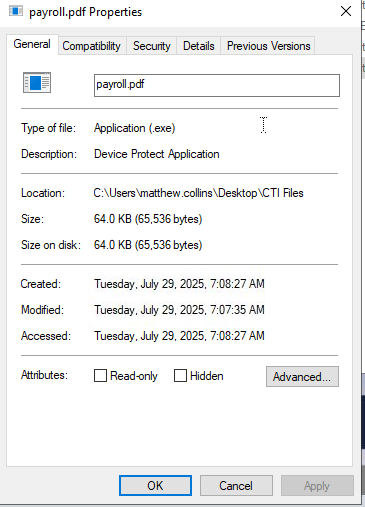
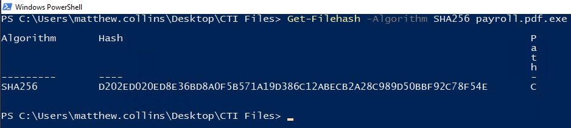

## Analisando Hash de arquivo no PowerShell

## Cenário

Um arquivo suspeito com o nome de "payroll.pdf" está em uma pasta no Desktop. Em uma primeira análise descobri que se trata de um executável.

Clicando com o botão direito verifiquei que a extensão é exe, por isso vou verificar o hash no PowerShell para depois analisar no VirusTotal e obter mais informações.

O comando que usarei no PowerShell para obter o hash é: 
### Get-Filehash -Algorithm SHA256 payroll.pdf

O hash é: D202ED020ED8E36BD8A0F5B571A19D386C12ABECB2A28C989D50BBF92C78F54E

E usando o VirusTotal confirmo analisando várias informações sobre o arquivo malicioso.

### Conclusão

Nessa laboratório utilizei duas ferramentas essenciais no dia a dia de um analista Soc para análise de malwares.
