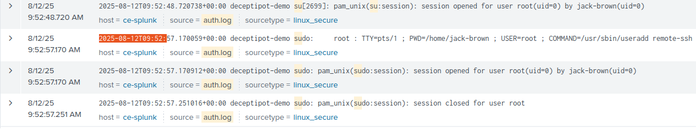
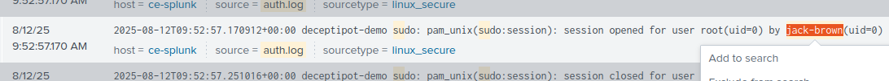
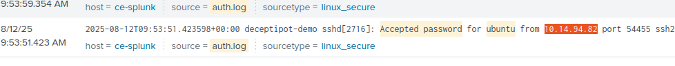
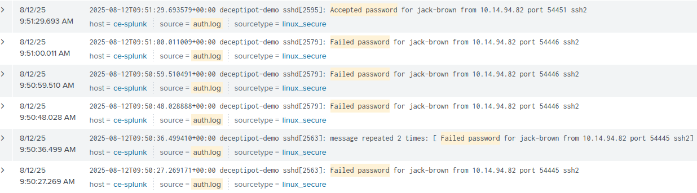
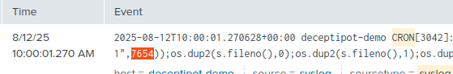

# Ataque criação de usuário remoto
**Cenário**
Sou um Analista SOC Nível 1 em turno e recebo um alerta indicando possível ataque através da criação de um novo usuário remoto em um servidor Ubuntu.
Minha tarefa é analisar os logs usando o Splunk e determinar exatamente o que aconteceu no sistema.

**1 - Qual foi o carimbo de data/hora da criação de conta de sistema remoto?**
Para descobrir isso usei essa consulta: 
**index=task5 source="auth.log" *su*
| sort + _time**

**Resposta: 2025-08-12 09:52:57**

**2 - Qual usuário escalou com sucesso seus privilégios para root antes da ação a partir da primeira pergunta?**
Usando a mesma consulta acima confirmei essa informação:

**Resposta: jack-brown**

**3 - A partir de qual endereço IP o usuário da pergunta anterior fez login com sucesso no sistema?**
Para descobrir isso usei a consulta: 
**index=task5 source="auth.log" *ubuntu* process=sshd
| search "Accepted password"**

**Resposta: 10.14.94.82**

**4 - Quantas tentativas de login fracassadas ocorreram antes desse login bem-sucedido?**
Usei a seguinte consulta:
**index=task5 source="auth.log"
| search "Accepted password" OR "Failed password"**

**Resposta: 5**

**5 - Qual porta é o mecanismo de persistência configurado para se conectar?**
Usei essa pesquisa: 
**index=task5 sourcetype=syslog ("CRON" OR "cron")**

**Resposta: 7654**

