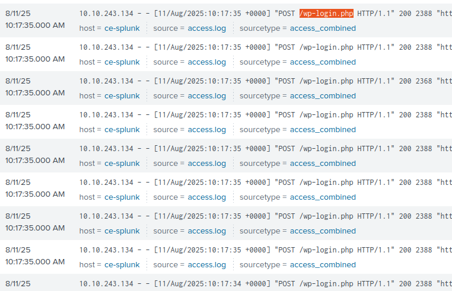
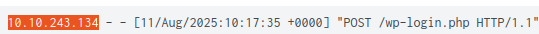
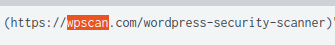

# Logs de aplicações web

**Cenário Prático**

Sou um Analista SOC de Nível 1 em meu turno e recebi um alerta indicando um pico de atividade no servidor web da organização. Minha tarefa é analisar os logs e determinar exatamente o que aconteceu. 

**1 - Qual caminho de URI teve o maior número de requisições?**  

Iniciei com essa consulta:  
**index="task6" e já apareceu:**

**Resposta: /wp-login.php** 

**2 -  Qual endereço IP foi a origem da atividade?**

Na mesma consulta identifiquei o IP: 

**Resposta: 10.10.243.134**

**3 - Como essa atividade pode ser classificada?**  

**Resposta: Pela quantidade de tentativas fica claro tratar-se de um clássico ataque de força bruta.**

**4 - Qual ferramenta o invasor utilizou?**  

**Resposta: WPScan**

