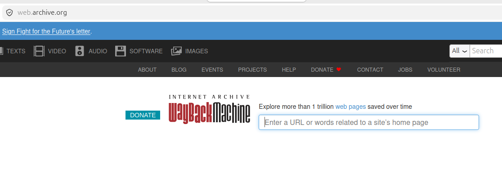

# Investigação OSINT com Wayback Machine

## Objetivo

Durante uma investigação OSINT, recebi a tarefa de coletar informações sobre uma empresa que havia removido diversas páginas de seu site oficial após denúncias envolvendo práticas comerciais questionáveis.

Meu objetivo era identificar quais informações estavam disponíveis publicamente antes dessas alterações e verificar possíveis inconsistências entre as versões antigas e atuais do site.

---

## Ferramenta Utilizada

- Wayback Machine

---

## Cenário

Ao acessar o site oficial da empresa, percebi que várias informações citadas em notícias e documentos antigos já não estavam mais disponíveis.

Para verificar o histórico do domínio, utilizei a Wayback Machine, uma ferramenta que armazena capturas de páginas da web realizadas em diferentes períodos.

Após inserir o domínio da organização na plataforma, identifiquei diversas versões arquivadas do site ao longo dos anos.

---

## Metodologia

1. Identificação do domínio alvo.
2. Consulta do domínio na Wayback Machine.
3. Análise das capturas disponíveis em diferentes datas.
4. Comparação entre versões antigas e a versão atual do site.
5. Registro das informações encontradas.
6. Construção de uma linha do tempo das alterações observadas.

---

## Descobertas

Durante a análise das versões históricas do site, foi possível identificar:

- Informações institucionais removidas da página principal.
- Nomes de executivos e responsáveis anteriormente divulgados.
- Filiais e escritórios que não eram mais mencionados.
- Produtos e serviços que deixaram de ser anunciados.
- Páginas excluídas, mas ainda acessíveis através dos registros históricos.
- Documentos públicos que já não estavam disponíveis no site atual.

---

## Análise

A comparação entre as versões arquivadas e a versão atual revelou alterações significativas no conteúdo disponibilizado pela empresa.

Essas mudanças permitiram compreender melhor a evolução da presença digital da organização e auxiliaram na validação de informações obtidas em outras fontes abertas.

Além disso, a análise histórica possibilitou a criação de uma linha do tempo contendo eventos relevantes relacionados às modificações do site.

---

## Resultados

- Recuperação de informações removidas.
- Identificação de mudanças institucionais ao longo do tempo.
- Localização de páginas anteriormente públicas.
- Coleta de evidências históricas para apoio à investigação.
- Construção de uma cronologia de alterações no domínio analisado.

---

## Conclusão

A Wayback Machine demonstrou ser uma ferramenta extremamente útil em atividades de OSINT, permitindo recuperar informações que já não estão disponíveis publicamente no site analisado.

A utilização de arquivos históricos pode fornecer contexto, evidências e informações valiosas para investigações corporativas, due diligence, análise de reputação e pesquisas em fontes abertas.

---

> **Observação:** Este cenário possui finalidade exclusivamente educacional e foi desenvolvido para demonstrar técnicas de investigação em fontes abertas (OSINT).
---
**Autor:** Paulo Cesar da Silva 
**Linkedin:** linkedin.com/in/paulo-cesar-security
