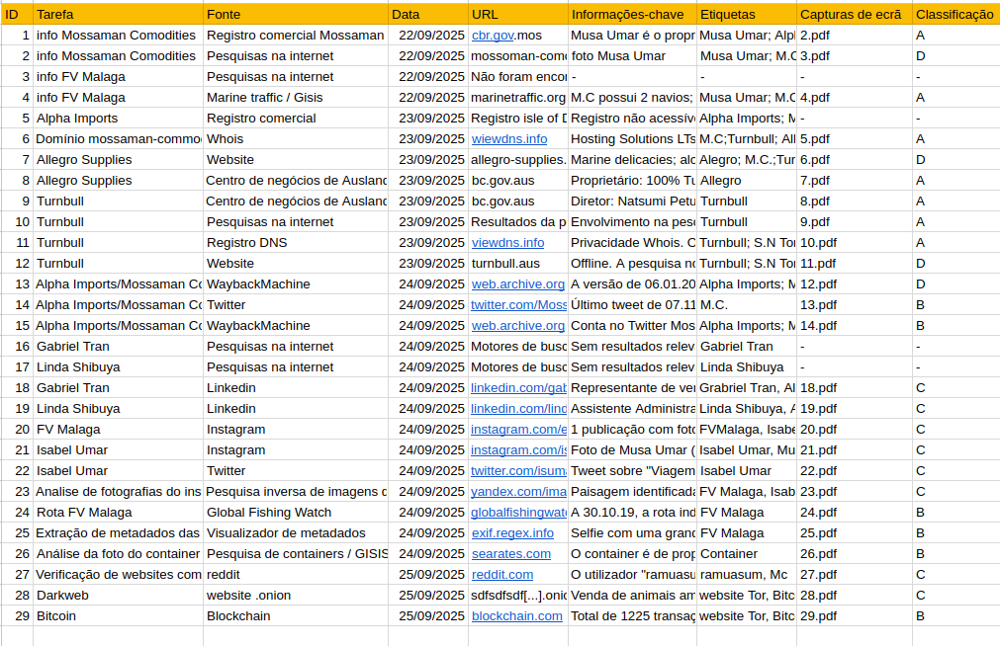

# Planilha OSINT

## Campos da planilha

**ID** - Identificação única para referenciar a fonte. 
**Tarefa** - Descreve as informações que estamos procurando. 
**Fonte** - Fonte a pesquisar para obter informações.  
**Data** - Data que realizamos a pesquisa.  
**URL** - Endereço da fonte que encontramos.  
**Informações-chave** - Resumo das principais informações encontradas na fonte.  
**Etiquetas** - As palavras-chave mencionadas nas informações. Ajuda-nos a filtrar a lista de acordo com entidades específicas (por exemplo, indivíduos ou organizações). 
**Capturas de ecrã** - Caminho/Nome do arquivo da captura de ecrã que obtivemos. 
**Classificação**: Confiabilidade da fonte, exemplo:

**A** - Confiável, não existe dúvida sobre a confiabilidade. 
**B** - Geralmente confiável, historico de informações confiáveis na maioria das vezes. 
**C** - Dúvidas, forneceu informações válidas no passado. 
**D** - Pouco confiável, Dúvidas significativas. 
**E** - Ausencia de autenticidade. Histórico de informações inválidas. 
**F** - Informações insuficientes para avaliar a confiabilidade. 
